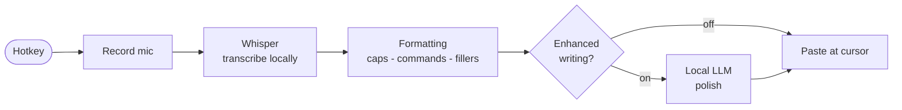

<p align="center">
  
</p>

> ## 📦 To install: double-click **`WisperLocal-Setup-0.6.1.exe`**
> That's everything you need — no Python, no setup, no command line. Once installed, you can delete this folder.
>
> The **`Source Code`** folder next to the installer holds the full project (Python code, build scripts, installer config, docs, and tests). You only need it to build or modify WisperLocal for future development — not to use the app.

<p align="center">
  <strong>Press a key. Talk. It types — wherever your cursor is.</strong>
</p>

<p align="center">
  
  
  
  
  
</p>

<p align="center">
  <a href="#-download">Download</a> &#183;
  <a href="#-features">Features</a> &#183;
  <a href="#-how-to-use">How to use</a> &#183;
  <a href="#-how-it-works">How it works</a> &#183;
  <a href="#-samples">Samples</a> &#183;
  <a href="#-for-developers">For developers</a>
</p>

---

**WisperLocal** is a private, on-device dictation app for Windows — a free, local alternative to tools like Wispr Flow. Press a global hotkey, speak, and your words are transcribed by [Whisper](https://github.com/openai/whisper) and pasted straight into whatever app you're using. **Nothing leaves your machine** — audio is never uploaded, and after a one-time model download it works fully offline.

It's **free and unlimited** — no accounts, no subscriptions, no telemetry, no per-word caps. A personal project by **Chaand Sheikh**.

<p align="center">
  
</p>
<p align="center"><sub><em>The floating overlay appears right where you're working — speak, then press the hotkey again (or click ✓) and the text lands at your cursor.</em></sub></p>

## ⬇️ Download

> 🟢 **Just want to use it?** Download the installer below — that's *everything you need*. No Python, no setup, no command line.

<p align="center">
  <a href="../../releases/latest"></a>
</p>

Grab **`WisperLocal-Setup.exe`** from the [latest release](../../releases) and run it — it's a **per-user installer, no admin required**. A 🎙️ icon then appears in your system tray. (Optional AI enhancement needs nothing extra — the model downloads itself on first use.)

> **Requirements:** Windows 10 or 11 · a microphone. Whisper models download automatically the first time you use them.

## ✨ Features

| | |
|---|---|
| 🎙️ **Global hotkey dictation** | Press `Ctrl+Alt+W` (configurable) in any app |
| 🌊 **Live listening overlay** | Floating waveform with cancel / insert buttons |
| 📋 **Pastes at the cursor** | Works in any app — keeps your place, no window-switching |
| ✍️ **Built-in formatting** | Capitalization, punctuation, spoken commands, filler removal |
| 🤖 **Optional AI polish** | Fix punctuation with a small **local** LLM (Qwen / Llama / Gemma) — never rewrites your words |
| 🧠 **Any Whisper model** | `tiny` → `large-v3-turbo`, downloaded on demand with a progress bar |
| ⚡ **CPU or GPU** | Runs on CPU; auto-uses your NVIDIA GPU when available |
| 🔁 **Toggle or push-to-talk** | Whichever recording style you prefer |
| 🔒 **100% local & private** | Offline after first download · no accounts · no telemetry |
| 💸 **Free & unlimited** | No subscriptions, no caps, ever |

## 🎬 How to use

1. Click into **any** text field — a browser, Notepad, your IDE, a chat box.
2. Press **`Ctrl+Alt+W`** → a beep sounds and the floating waveform appears.
3. **Speak.** Press **`Ctrl+Alt+W`** again (or click ✓) to stop.
4. Your text is transcribed, cleaned up, and pasted right where your cursor was.

Double-click the tray icon any time to open the home window, run a **system test**, or change settings.

<p align="center">
  
</p>

## 🧠 Models

Pick speed vs. accuracy — models download on demand with a progress bar, so the installer stays tiny (nothing is bundled).

| Model | Size | Speed | Accuracy |
|-------|-----:|-------|----------|
| `tiny` / `base` | 75–150 MB | ⚡⚡⚡ | Good for quick notes |
| `small` *(default)* | ~480 MB | ⚡⚡ | Great everyday balance |
| `medium` | ~1.5 GB | ⚡ | More accurate |
| `large-v3-turbo` | ~1.6 GB | ⚡⚡ | Best, and fast on a GPU |

## 🤖 Enhanced writing

For an extra touch of polish, WisperLocal can run your transcript through a **small local language model** that runs **fully in-process** — no Ollama, no server, nothing to keep running. Pick a lightweight model in Settings (Qwen 0.5B/1.5B, Llama 3.2 1B, or Google Gemma 2 2B); it downloads itself once from Hugging Face and is cached on your machine, then runs offline. It's deliberately **conservative** — it only fixes punctuation and capitalization and **never rewrites, rephrases, or reorders your words** — and is **off by default**.

```text
"so i think we should ship the feature on friday and tell the team"
                                   ↓
"So I think we should ship the feature on Friday, and tell the team."
```

## 🔧 How it works



Every step runs on your computer. Full walk-through: **[HOW_IT_WORKS.md](Source Code/docs/HOW_IT_WORKS.md)**.

## ⚙️ Settings

Model, hotkey, microphone, language, CPU/GPU, recording mode, formatting rules, and enhanced writing — all from one dialog.

<p align="center">
  
</p>

## 💬 Samples

Real dictation, cleaned up entirely on-device — more in **[SAMPLES.md](Source Code/docs/SAMPLES.md)**:

> 🎙️ *"the the main point is um we need a lot more testing before we ship"*
> ✍️ **WisperLocal:** *"The main point is we need a lot more testing before we ship."*

## 🗺️ Roadmap

- [ ] Per-app profiles (different model/formatting per application)
- [ ] Custom vocabulary & text replacements
- [ ] Streaming / partial transcription
- [ ] More enhanced-writing backends
- [ ] Linux / macOS support

---

## 🧑‍💻 For developers

> ℹ️ You only need this section to **build or modify** WisperLocal. To just use the app, [download the installer](#-download) above — you don't need any of this.

WisperLocal is a Python app (faster-whisper + PySide6). It runs from source on Python 3.12. **All source lives in the `Source Code` folder** — `cd "Source Code"` first, or clone the repo.

<details>
<summary><strong>Run from source</strong></summary>

```bash
cd "Source Code"
scripts\setup.bat     # creates a venv and installs dependencies
scripts\run.bat       # start it (or double-click scripts\run-hidden.vbs for no console)
```
</details>

<details>
<summary><strong>Build the app &amp; installer</strong></summary>

```bash
cd "Source Code"
scripts\build.bat            # PyInstaller -> dist\WisperLocal\WisperLocal.exe
scripts\build-installer.bat  # Inno Setup  -> installer_output\WisperLocal-Setup-x.y.z.exe
```
Details (GPU bundling, Inno Setup) in [PACKAGING.md](Source Code/docs/PACKAGING.md).
</details>

<details>
<summary><strong>Project layout</strong></summary>

```
WisperLocal/
├── WisperLocal-Setup-0.6.1.exe   # the installer — double-click to install
├── README.md  CHANGELOG.md       # this file + version history
└── Source Code/                  # full project, for future development
    ├── LICENSE  requirements.txt
    ├── run_app.py  WisperLocal.spec   # PyInstaller entry + spec
    ├── wisperlocal/    the app — controller, transcriber, overlay, enhancer, ...
    ├── assets/         app icon
    ├── docs/           screenshots + HOW_IT_WORKS - SAMPLES - PACKAGING - RELEASING
    ├── scripts/        setup - run - build - build-installer - run-hidden
    ├── installer/      WisperLocal.iss (Inno Setup)
    ├── tools/          gen_icon.py - gen_assets.py
    └── tests/          smoke_test.py - tts_test.py
```
</details>

**Releasing:** see **[RELEASING.md](Source Code/docs/RELEASING.md)** and **[CHANGELOG.md](CHANGELOG.md)**. Pushing a `vX.Y.Z` tag triggers [GitHub Actions](.github/workflows/release.yml), which builds the GPU-accelerated installer and publishes a Release. The CI builds llama.cpp with the **Vulkan** backend (GPU on NVIDIA/AMD/Intel, CPU fallback) and AVX disabled (runs on any CPU). A macOS (Metal) job is included but experimental — the app still needs platform adaptation (paste keystroke, startup mechanism) to be fully functional there.

## 🛠️ Built with

[faster-whisper](https://github.com/SYSTRAN/faster-whisper) · [CTranslate2](https://github.com/OpenNMT/CTranslate2) · [llama-cpp-python](https://github.com/abetlen/llama-cpp-python) · [PySide6](https://doc.qt.io/qtforpython/) · [sounddevice](https://python-sounddevice.readthedocs.io/) · [pynput](https://github.com/moses-palmer/pynput) · [Inno Setup](https://jrsoftware.org/isinfo.php)

## 📄 License

[MIT](Source Code/LICENSE) © 2026 Chaand Sheikh — do anything you like, just keep the notice. Whisper models carry their own (MIT) licenses.

<p align="center"><sub>Built for people who'd rather talk than type — and keep their words to themselves.</sub></p>
