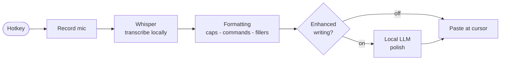

# How WisperLocal works

WisperLocal turns your voice into text **entirely on your own PC**. Here's the journey of a single dictation, end to end:

1. **Trigger** — A global hotkey (default `Ctrl+Alt+W`) works in any application, even when WisperLocal is minimized to the tray.
2. **Listen** — It records your microphone and shows a floating overlay with a live waveform, so you always know it's hearing you. Press the hotkey again, or click the ✓, to stop (or ✕ to cancel).
3. **Transcribe** — A local [Whisper](https://github.com/openai/whisper) speech-to-text model converts your audio to text. Models run on your CPU or, if you have one, your NVIDIA GPU. **Nothing is uploaded.**
4. **Format** — A fast, offline cleanup pass fixes capitalization and punctuation, applies spoken commands like *"new line"* and *"new paragraph"*, and can strip filler words (*um*, *uh*).
5. **Enhance (optional)** — If you turn it on, a small **local** language model (your pick of Qwen, Llama, or Google's Gemma) fixes punctuation and capitalization. It runs fully in-process — no server, no Ollama — and never rewrites your words.
6. **Insert** — The finished text is pasted at your cursor, in whatever app you're using — keeping your focus exactly where it was.

## Private by design

- 🔒 Your audio and text never leave your device.
- 📴 Works fully offline after the one-time model download.
- 🚫 No accounts, no telemetry, no cloud services.

## On-device models

WisperLocal uses local Whisper models that download on demand (with a progress bar) — from a tiny ~75 MB model for quick notes up to large models for maximum accuracy. The optional writing enhancement runs a small local LLM (a quantized GGUF model via llama.cpp) **in-process** — it's downloaded once from Hugging Face and cached on your machine, then runs offline with no server to install or keep running.

Because everything is local, there are **no usage limits and no cost** — dictate as much as you like.
